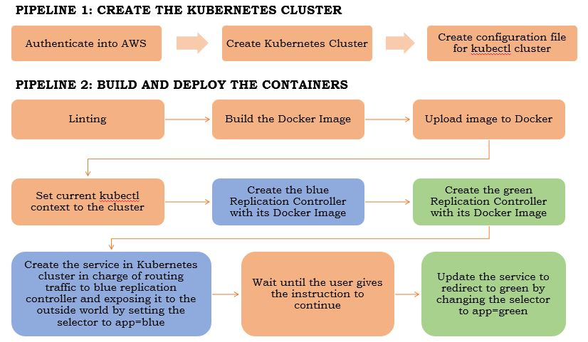
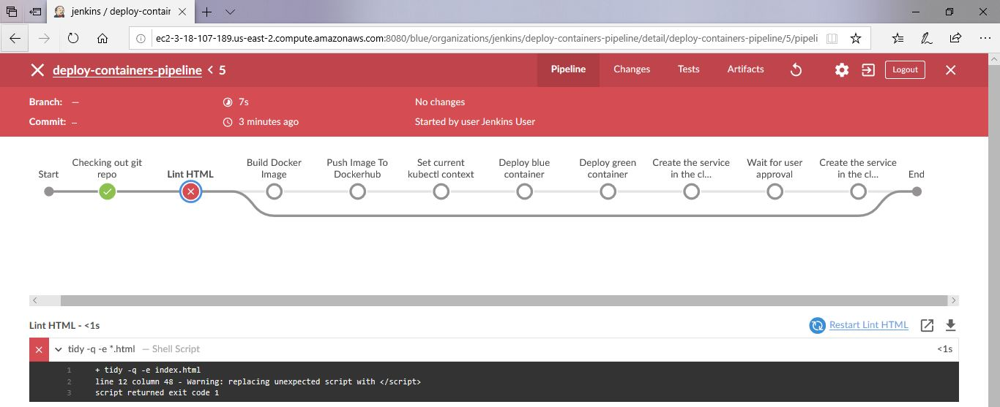
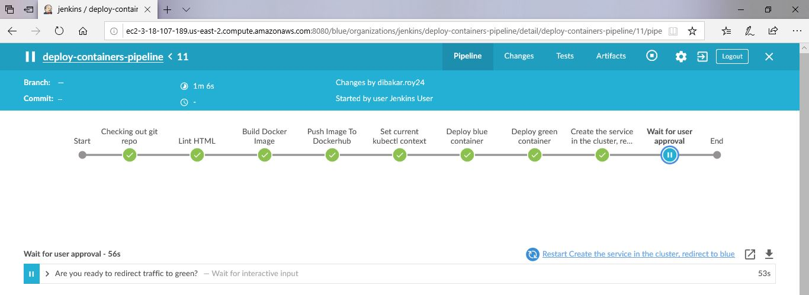

# Cloud DevOps Engineer Capstone Project
In this project, I applied the skills and knowledge which were developed throughout the Cloud DevOps Nanodegree program to build a CI/CD pipeline for a microservices application with either blue/green deployment or rolling deployment. These include:
* Working in AWS
* Using Jenkins to implement Continuous Integration and Continuous Deployment
* Building pipelines
* Working with Ansible and CloudFormation to deploy clusters
* Building Kubernetes clusters
* Building Docker containers in pipelines

## About Project: 

I created a CI/CD pipeline for a basic website that deploys to a cluster in AWS EKS which is Blue/Green Deployment.



## Project Steps:

## Step 1: Propose and Scope the Project
* Plan what your pipeline will look like.
* Decide which options you will include in your Continuous Integration phase.
* Pick either Jenkins or Jenkins X to use.
* Pick a deployment type - either rolling deployment or blue/green deployment.
* For the Docker application you can either use an application which you come up with, or use an open-source application pulled from the Internet, or if you have no idea, you can use an Nginx “Hello World, my name is (student name)” application.
## Step 2: Use Jenkins or Jenkins X, and implement blue/green or rolling deployment.
* Create your Jenkins master box with either Jenkins or Jenkins X and install the plugins you will need.
* Set up your environment to which you will deploy code.
## Step 3: Pick AWS Kubernetes as a Service or build your own Kubernetes cluster.
* Use Ansible or CloudFormation to build your “infrastructure”; i.e., the Kubernetes Cluster.
* It should create the EC2 instances (if you are building your own), set the correct networking settings, and deploy software to these instances.
* As a final step, the Kubernetes cluster will need to be initialized. The Kubernetes cluster initialization can either be done by hand, or with Ansible/CloudFormation at the student’s discretion.
## Step 4: Build your pipeline
* Construct your pipeline in your GitHub repository.
* Set up all the steps that your pipeline will include.
* Configure a deployment pipeline.
* Include your Dockerfile/source code in the Git repository.
* Include with your Linting step both a failed Linting screenshot and a successful Linting screenshot to show the Linter working properly.





## Step 5: Test your pipeline
* Perform builds on your pipeline.
* Verify that your pipeline works as you designed it.
* Take a screenshot of the Jenkins pipeline showing deployment and a screenshot of your AWS EC2 page showing the newly created (for blue/green) or modified (for rolling) instances. Make sure you name your instances differently between blue and green deployments.

## Project Requirements:

To be able to use this CI/CD pipeline you will need to install:

* Jenkins
* Blue Ocean Plugin in Jenkins
* Pipeline-AWS Plugin in Jenkins
* Docker
* Pip
* AWS CLI
* Eksctl
* Kubectl

## The files included are:
```sh
* /result-images : Screenshot the result of deploy.
* /create-clusters-pipeline : CloudFormation Script of Cluster Pipeline file 
* /Deploy-containers-pipeline : Deployment Script of Containers Pipeline file
* Jenkinsfile : Jenkinsfile for Creating Pipeline
* Dockerfile : Dockerfile for building the image 
* green-controller.json : Create a replication controller green pod
* green-service.json : Create the green service
* blue-controller.json : Create a replication controller blue pod
* blue-service.json : Create the blue service
* index.html : Web site Index file.
```
